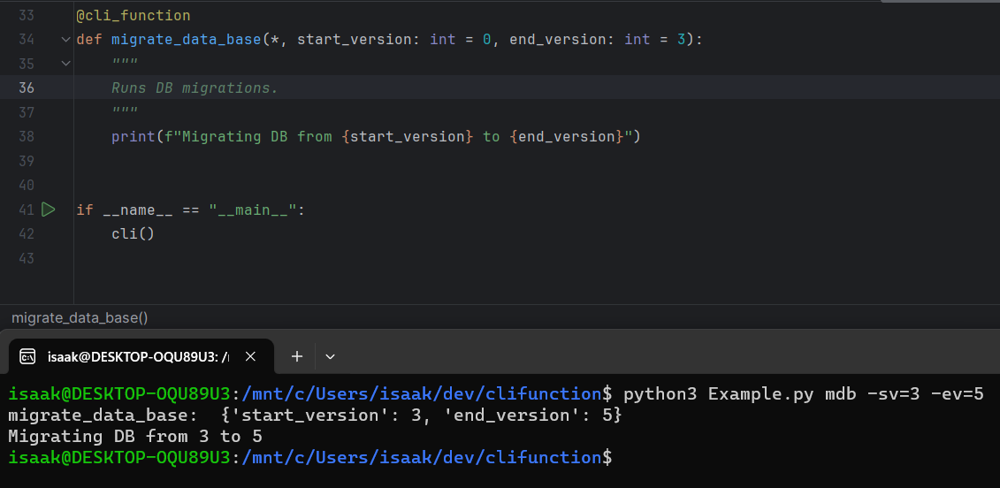

# clifunction
Enables you to build a CLI with python in the most straightforward way with the fewest lines of code:

# Full Documentation:
https://isaak-malers.github.io/clifunction/#getting-started

# Get it with PIP:
https://pypi.org/project/clifunction/

# Interested in Contributing?:
1. Create, or find an issue.  All branches must be tied to a github issue.
2. Create a branch for your issue.  It should be named after the issue number and with an optional description
3. Make and test feature/fix/change on the branch
4. Add Pull request for the branch, ensuring issue is linked so that reviewers have context for the changeset.
